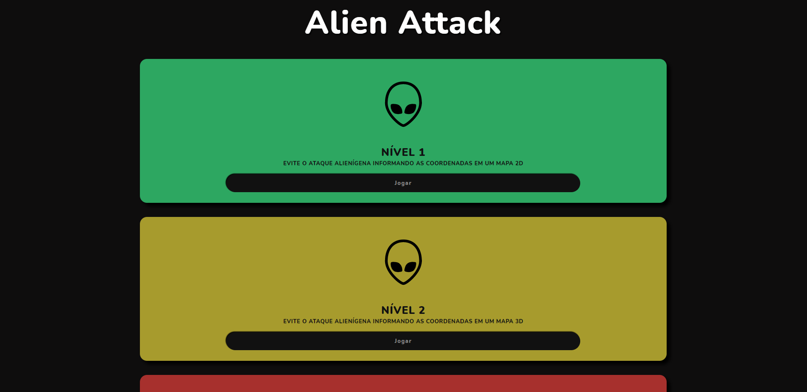
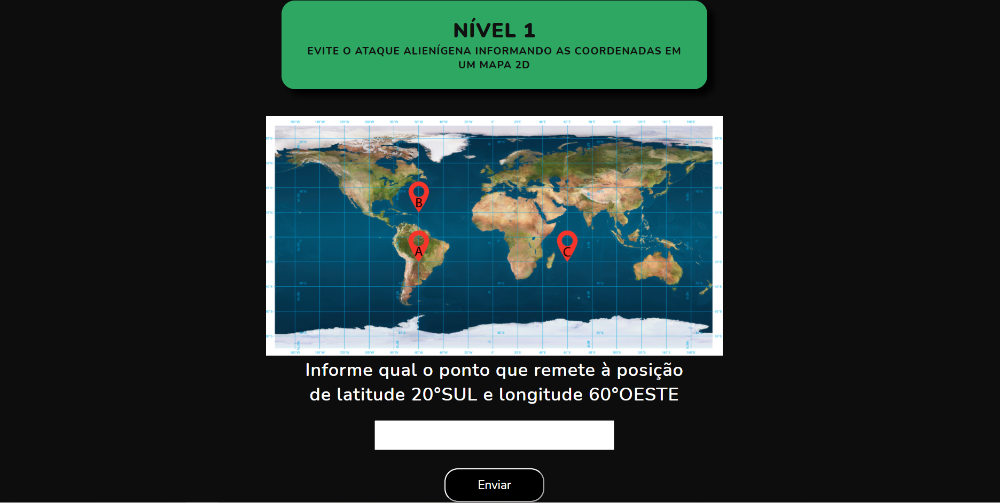
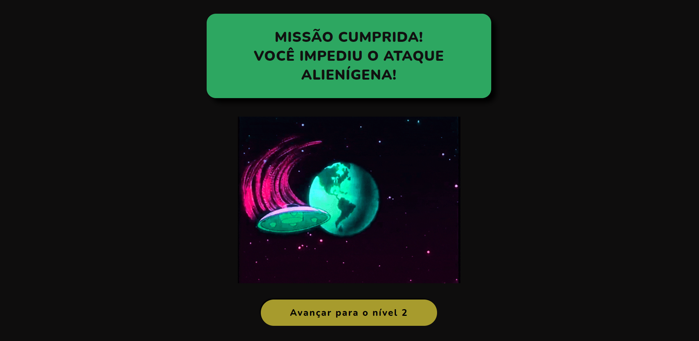
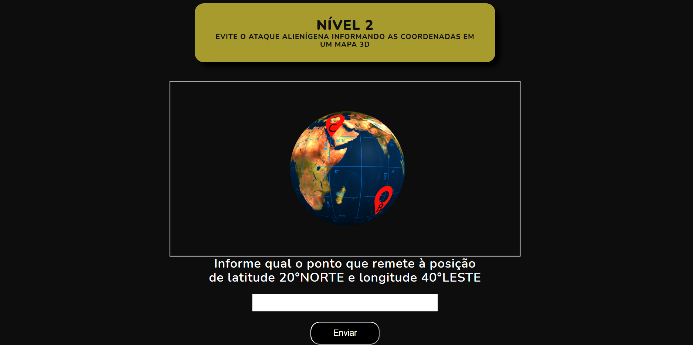

# Latitude e Longitude Geográfica
## Trabalho em desenvolvimento...

Trabalho de representação interativa e tridimensional sobre conceitos de coordenadas.

## Screenshots do Projeto 🎞

  
  
  
  

**PUC Minas - Poços de Caldas**

Autores:
- Lucas De Godoi Moraes
- Harrison Souza Araujo
- Gilber Vitor Araujo
- Rodrigo Franco De Melo Nogueira
- Maria Amélia Doná Aguilar

Orientadores:
- Fabiano Costa Teixeira
- João Carlos de Moraes Morselli Junior

Agradecimento:
- Andre Fonseca de Paiva

------------
